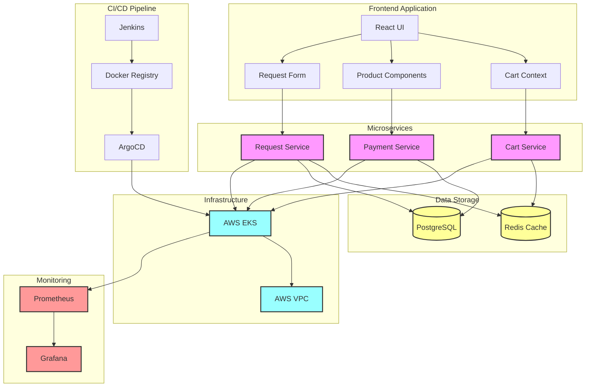

# E-commerce System Architecture

## Component Descriptions

1. **Frontend Application**
   - React UI with TypeScript
   - Cart state management using Context API
   - Product catalog and Request form components

2. **Microservices**
   - Cart Service: Manages shopping cart operations
   - Payment Service: Handles payment processing
   - Request Service: Processes product requests

3. **Data Storage**
   - Redis: Caching and session management
   - PostgreSQL: Primary database for orders and products

4. **Infrastructure**
   - AWS EKS: Kubernetes cluster management
   - VPC: Network isolation and security

5. **CI/CD Pipeline**
   - Jenkins: Automated build and deployment
   - Docker Registry: Container image storage
   - ArgoCD: Kubernetes deployment management

6. **Monitoring**
   - Prometheus: Metrics collection
   - Grafana: Visualization and alerting

## Data Flow

1. **User Interactions**
   - Users interact with the React frontend
   - Cart state is managed locally and synced with Cart Service
   - Product requests are sent to Request Service

2. **Service Operations**
   - Cart Service uses Redis for temporary storage
   - Payment Service connects to PostgreSQL for order processing
   - Request Service uses both Redis and PostgreSQL

3. **Deployment Flow**
   - Code changes trigger Jenkins pipeline
   - Docker images are built and pushed to registry
   - ArgoCD deploys to Kubernetes cluster

4. **Monitoring Flow**
   - Services expose metrics endpoints
   - Prometheus scrapes metrics
   - Grafana displays dashboards and alerts